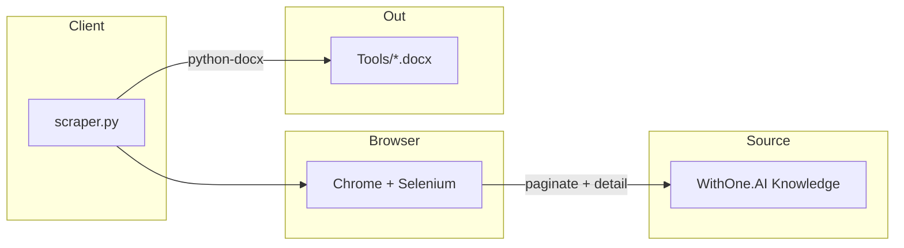

<div align="center">

<!-- ═══════════════════════════════════════════════════════════
     HERO BANNER — Scrapper × slate cyan
     ═══════════════════════════════════════════════════════════ -->


<br/>

### Universal platform action scraper for WithOne.AI

Paginated crawl · HTTP methods · Endpoints · Parameters · Word export  
— one Python script, Selenium + Chrome, free & open-source stack.

<br/>

<!-- ═══════════════════════════════════════════════════════════
     STICKER / BADGE STRIP
     ═══════════════════════════════════════════════════════════ -->

[](https://www.python.org/)
[](https://www.selenium.dev/)
[](https://chromedriver.chromium.org/)
[](https://python-docx.readthedocs.io/)

<br/>

[](#-license)
[](https://www.withone.ai/knowledge/)
[](#-what-you-get)
[](#-supported-platforms)

<br/>

[](https://github.com/Bixal99/Scrapper)
[](https://github.com/Bixal99/Scrapper/fork)
[](https://github.com/Bixal99/Scrapper/issues)

</div>

---

## ✨ At a Glance

<table>
<tr>
<td width="33%" align="center">

### 🔎 Smart Pagination
Detects total pages per platform  
stops when the list ends — no hard caps

</td>
<td width="33%" align="center">

### 📦 Rich Extraction
Titles · methods · endpoints  
params · tables · code samples

</td>
<td width="33%" align="center">

### 📄 Word Export
One `.docx` per platform  
formatted headings, lists & tables

</td>
</tr>
</table>

**Core flow**

```text
Open knowledge page  →  Walk paginated action list  →  Open each action
        ↓                                                      ↓
   Detect page count                              Strip UI noise / keep code
                                                              ↓
                                              Write platform-tools.docx
```

---

## 🧩 Tech Stack

<div align="center">

### Runtime & Automation
<br/>

[](https://skillicons.dev)

| | Tool | Role |
|:---:|:---|:---|
| 🐍 | **Python 3.10+** | Scraper runtime |
| 🟢 | **Selenium** | Browser automation against WithOne.AI |
| 🌐 | **Chrome / ChromeDriver** | Page load, scroll, click-through |
| 📝 | **python-docx** | Professionally formatted Word output |

<br/>

### Content Pipeline
<br/>

| | Piece | Role |
|:---:|:---|:---|
| 🧹 | **Noise filters** | Strip nav chrome, “Copy code”, suggest-edit UI |
| 🧭 | **Heading heuristics** | Promote real section titles, skip code-like lines |
| 📊 | **Table detection** | Pipe / tab / multi-space columns → Word tables |
| 💾 | **Tools/** | Output folder for `{platform}-tools.docx` |

</div>

---

## 🌟 Features

<table>
<tr>
<td valign="top" width="50%">

#### 🧠 Intelligent Page Detection
Infers how many list pages exist for a platform and walks them until results end.

#### 📋 Action Extraction
Captures action titles, HTTP methods (`GET`, `POST`, `PUT`, `DELETE`, …), endpoints, and detail pages.

#### 🧰 Multi-Platform Ready
`PlatformScraper` takes any WithOne.AI knowledge URL — one class for every catalog.

</td>
<td valign="top" width="50%">

#### ✨ Clean Document Output
Headings, lists, monospace code lines, and tables written into Word with stable formatting.

#### 🛡️ Content Hygiene
Drops exact UI strings and noisy phrases while preserving code blocks and language tags correctly.

#### 📁 Batch Exports
`Tools/` already holds 250+ platform exports from prior runs for reference.

</td>
</tr>
</table>

<div align="center">

### Catalogs at a glance


</div>

---

## 📋 Prerequisites

| Requirement | Notes |
|:---|:---|
| **Python ≥ 3.10** | Virtualenv recommended (`.venv`) |
| **Google Chrome** | Installed locally for Selenium |
| **pip packages** | `selenium`, `webdriver-manager` *(optional)*, `python-docx` |

---

## 🚀 First-Time Setup

```bash
# 1. Clone
git clone https://github.com/Bixal99/Scrapper.git
cd Scrapper

# 2. Virtual environment
python -m venv .venv

# Windows
.venv\Scripts\activate

# macOS / Linux
source .venv/bin/activate

# 3. Dependencies
pip install -r requirements.txt

# 4. Run (default target: GitHub knowledge base)
python scraper.py
```

| Artifact | Location |
|:---|:---|
| 🔌 **Script** | `scraper.py` |
| 📄 **Exports** | `Tools/{platform}-tools.docx` |

> **Optional limits:** `--max-pages=N` · `--max-actions=N`

Environment / secrets are not required — the scraper reads public WithOne.AI knowledge pages.

---

## 📜 Scripts & Flags

| Command | Purpose |
|:---|:---|
| `python scraper.py` | Scrape GitHub actions → `Tools/github-tools.docx` |
| `python scraper.py --max-pages=5` | Cap list pagination |
| `python scraper.py --max-actions=50` | Cap how many action detail pages to open |

---

## 📄 What You Get

For each platform, a Word document containing:

- **Title** — platform name + actions
- **Summary** — total count and source URL
- **Body** — numbered actions with methods, endpoints, params, tables, and code samples

**Example:** large catalogs (e.g. Jira) can span dozens of list pages and hundreds of actions.

---

## 🗂️ Workspace

```text
Scrapper/
├── scraper.py           # Selenium crawler + Word writer
├── requirements.txt     # Python dependencies
├── Tools/               # Generated {platform}-tools.docx exports
├── web/                 # Vercel landing page
├── vercel.json
└── README.md
```

<div align="center">



</div>

---

## 🧭 Development Notes

Scrapper is a **local CLI tool**. Heading detection only promotes short Title Case / ALL CAPS lines followed by substantive content; code-like prefixes and sentence-ending punctuation are never treated as headings. Navigation uses direct URLs (not `driver.back()`) to avoid stale pages.

Live landing page: **[helpscript.vercel.app](https://helpscript.vercel.app)** — documentation only. Browser automation must run on your machine (Chrome + Selenium).

---

## 🌐 Supported Platforms

Exports in `Tools/` cover a wide WithOne.AI catalog, including:

### Development & Collaboration
GitHub · GitLab · Linear · Jira · Trello · Asana · Monday · Confluence

### Communication
Slack · Discord · Intercom · Zoom · Google Meet

### Productivity & Documents
Notion · Google Drive · Google Docs · Figma · Loom

### Business & Analytics
HubSpot · Salesforce · Zendesk · Datadog · PagerDuty

### Payments & More
Stripe · GitHub Actions · and 200+ additional integrations already exported

Point `PlatformScraper` at any `https://www.withone.ai/knowledge/{slug}` URL to add another catalog.

---

## 📄 License

**Private / unpublished** — for local Scrapper development.

---

<div align="center">


<br/>

**[⬆ Back to top](#-at-a-glance)**

<br/>

<sub>Scrapper · WithOne.AI · Selenium · Python · python-docx</sub>

</div>
